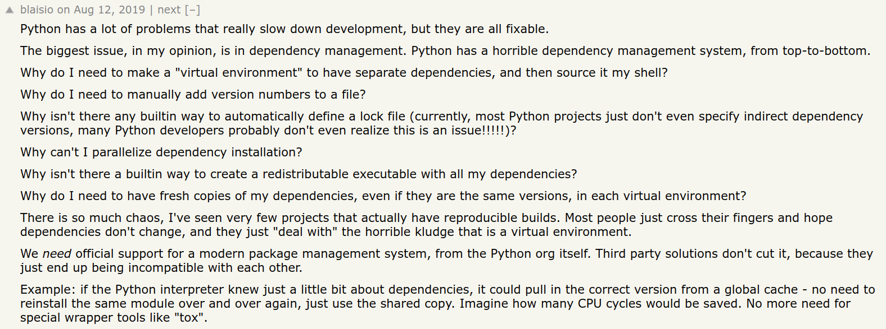

# Паковка и поставка python-утилит

Любую утилиту, чтобы она могла приносить пользу, необходимо поставлять конечному пользователю в каком-либо виде.
Стандартный способ публикации для python-утилит --- запаковать и отправить в pypi.
Способ хороший и очень правильный, но есть детали.

* **Дистрибуция.** PyPi --- публичный реестр, возможно мы не хотим или не можем выставлять приложение на всю публику.
    В таком случае, придётся поднимать свой приватный реестр, а его надо кормить, любить и поддерживать.
* **Зависимости.** Если поставляем утилиту в виде python-пакета, приходится требовать от пользователя наличие python'а,
    да ещё и определённой версии.
* **Простота использования.** Этот пункт напрямую связан с предыдущими. Если криво поставить python и наложить сложности с 
    приватными репозиториями и зависимостями, то получится *dumpster fire*, с которым мало кому хочется разбираться.


На [HN есть обсуждение](https://news.ycombinator.com/item?id=20672051) проблем python'а и его зависимостей, довольно интересно почитать:


## Другие варианты поставки

Кроме традиционной паковки python-приложений есть другие варианты:

* Поставлять VM с развёрнутым приложением:
    * Самый надёжный и ж*ы*рный вариант.
    * На [HN](https://news.ycombinator.com/) был коммент вида "we ship a whole fucking Windows VM to avoid problems with Python depencencies", но не могу его откопать.
* Поставлять docker-образ с развёрнутым приложением:
    * По надёжности сопоставим с VM и совсем не ж*ы*рный.
    * Требует зависимости от docker'а, а он может не везде работать.
        * Пример: на дешёвых VPS с OpenVZ и старым ядром docker не заводится.
        * Пример 2: у меня не получилось втащить docker на Astra Linux 1.4.
* Поставлять бинарник/архив с python'ом, зависимостями и исходниками.

Рассмотрим последний вариант, т.к. он звучит наименее отвратительно.

## Паковщики

Для упаковки утилиты в бинарник/архив нам потребуется некая машинерия, которая запакует все ресурсы и интерпретатор в один файл.

В *простейшем* случае это будет [bash-скрипт](https://gist.github.com/ChrisCarini/d3e97c4bc7878524fa11) с приписанным в конце tar-архивом (примерно так работают [rarjpeg'и](https://gist.github.com/cianb96/8089653)):
<style>
    #article-content-container .gist-embedded td { border: 0px; }
</style>
<div class="gist-embedded">
    <script src="https://gist.github.com/ChrisCarini/d3e97c4bc7878524fa11.js"></script>
</div>

В этом случае нам потребуется вручную сделать архив с portable-интерпретатором, зависимостями, исходниками и путями.
Делать этого не хочется, поэтому сравним пару готовых вариантов: 
[pyinstaller](https://pyinstaller.org/) и [PyOxidizer](https://github.com/indygreg/PyOxidizer).

### pyinstaller

[pyinstaller](https://pyinstaller.org/) работает как классический self-extracting archive: 
при запуске бинарника [он распаковывает ресурсы в `%tmp%`]((https://pyinstaller.org/en/stable/operating-mode.html#how-the-one-file-program-works)), запускает интерпретатор с правильными путями, схлопывается
и подчищает за собой мусор.

Здесь сразу вылезает проблема: при каждом запуске проходит процесс распаковки на диск, что довольно дорого по сравнению с обычным питоном:
```sh
$ hyperfine "./dist/test" "python3.8 ./test.py" --warmup 10

Benchmark 1: ./dist/test
 Time (mean ± ): 278.4 ms ± 3.2 ms [User: 225.1 ms, System: 58.7 ms]
 Range (min … max): 274.6 ms … 284.7 ms 10 runs
Benchmark 2: python3.8 ./test.py
 Time (mean ± ): 92.2 ms ± 2.5 ms [User: 83.5 ms, System: 8.7 ms]
 Range (min … max): 89.3 ms … 100.5 ms 32 runs
Summary
 'python3.8 ./test.py' ran 3.02 ± 0.09 times faster than './dist/test'
```

### pyoxidizer

[PyOxidizer](https://github.com/indygreg/PyOxidizer) отличается тем, что не распаковывает ресурсы во временную директорию, а использует их
прямо из бинарника, включая интерпретатор. Получаем отличную производительность на запуск:
```sh
$  hyperfine "./build/x86_64-unknown-linux-gnu/debug/install/test" "python3.8 ./test.py" --warmup 10
Benchmark 1: ./build/x86_64-unknown-linux-gnu/debug/install/test
 Time (mean ± ): 102.1 ms ± 3.3 ms [User: 95.8 ms, System: 6.2 ms]
 Range (min … max): 96.6 ms … 107.5 ms 29 runs
Benchmark 2: python3.8 ./test.py
 Time (mean ± ): 95.6 ms ± 3.0 ms [User: 87.1 ms, System: 8.5 ms]
 Range (min … max): 93.4 ms … 111.1 ms 31 runs
Summary
 'python3.8 ./test.py' ran 1.07 ± 0.05 times faster than './build/x86_64-unknown-linux-gnu/debug/install/test'
```

Теоретически, pyoxidized-бинарник может работать быстрее обычного python'а: такое можно получить на проекте с большим количеством файлов,
где импорты с диска будут медленнее машинерии и импортов из памяти. Почитать об этом можно [в посте одного из разработчиков pyoxidizer'а](https://gregoryszorc.com/blog/2018/12/28/faster-in-memory-python-module-importing/).

Далее будем рассматривать именно pyoxidizer.

## Перекись питона

PyOxidizer --- набор модулей, написанных на [модном, стильном, молодёжном rust'е](https://www.rust-lang.org/), 
которые позволяют управлять интерпретатором python'а.

Насколько мне известно, развитие в эту сторону началось с [inline_python](https://github.com/fusion-engineering/inline-python), 
который позволял инлайнить python-скрипты прямо в rust-код:
```rust
use inline_python::python;

fn main() {
    let who = "world";
    let n = 5;
    python! {
        for i in range('n):
            print(i, "Hello", 'who)
        print("Goodbye")
    }
}
```

Под капотом он использует [pyo3](https://github.com/PyO3/pyo3) --- библиотеку для связи python'а и rust'а.
Этот же движок используется и в [pyembed](https://pyoxidizer.readthedocs.io/en/stable/pyembed.html) --- модуле pyoxidizer'а,
реализующем управление интерпретатором python'а:
```rust
fn do_it(interpreter: &MainPythonInterpreter) -> {
    interpreter.with_gil(|py| {
         match py.eval("print('hello, world')") {
            Ok(_) => print("python code executed successfully"),
            Err(e) => print("python error: {:?}", e),
        }
    });
}
```

Ещё одна важная часть pyoxidizer'а --- [oxidized_import](https://pyoxidizer.readthedocs.io/en/stable/oxidized_importer.html), кастомный
резолвер импортов, реализующий загрузку ресурсов (в том числе из памяти), их сканирование и сериализацию.

Для создания standalone-бинарников используется непосредственно [pyoxidizer](https://pyoxidizer.readthedocs.io/en/stable/pyoxidizer.html),
комбинирующий в себе pyembed и oxidized_import. 

[В документации](https://pyoxidizer.readthedocs.io/en/stable/pyoxidizer_overview.html#how-it-works) описано, как это работает.
Краткий и очень вольный пересказ:
* собирается `pyembed` с оптимизированным для встраивания бинарником интерпретатора;
* собирается архив с исходниками и зависимостями python-утилиты;
* из `pyembed` и архива ресурсов собирается готовый бинарник.

Машинерия pyoxidizer'а достаётся нам не бесплатно --- есть пара загвоздок в виде загрузки не-питон-ресурсов и C-модулей.

### Загрузка ресурсов

В стандартном python'е для загрузки ресурсов с диска --- например, шаблонов, данных, изображений и etc. --- используется 
глобальная переменная `__file__`, указывающая на путь к текущему файлу в системе:
```python
def get_resource(name):
    """Return a file handle on a named resource next to this module."""
    module_dir = os.path.abspath(os.path.dirname(__file__))
    resource_path = os.path.join(module_dir, name)

    return open(resource_path, 'rb')
```

Однако, с этой переменной есть проблемы:
>The pathname of the file from which the module was loaded, if it was loaded from a file. The `__file__` attribute may be missing for certain types of modules, such as C modules that are statically linked into the interpreter. For extension modules loaded dynamically from a shared library, it’s the pathname of the shared library file.

То есть, даже официальная документация говорит, что `__file__` может быть не задан.

В случае с pyoxidizer'ом, `__file__` теряет весь свой смысл, т.к. модули загружаются из памяти.
Заметки из [документации pyoxidizer'а](https://pyoxidizer.readthedocs.io/en/stable/pyoxidizer_technotes.html):
>It isn’t clear whether `__file__` is actually required and what all is derived from existence of `__file__`. It also isn’t clear what `__file__` should be set to if it wouldn’t be a concrete filesystem path. Can `__file__` be virtual? Can it refer to a binary/archive containing the module?

По умолчанию, `__file__` в pyoxidized-бинарниках не задан, и [рекомендуется](https://pyoxidizer.readthedocs.io/en/v0.7.0/packaging_resource_files.html#porting-code-to-modern-resources-apis) использовать `ResourceAPI` (Python 3.7+):
```python
def get_resource(name):
    """Return a file handle on a named resource next to this module."""
    # get_resource_reader() may not exist or may return None, which this
    # code doesn't handle.
    reader = __loader__.get_resource_reader(__name__)
    return reader.open_resource(name)
```

### C-расширения

Pyoxidizer [поддерживает](https://pyoxidizer.readthedocs.io/en/v0.7.0/status.html#native-extension-modules) использование C-модулей, но с некоторыми
пометками:

* Building C extensions to be embedded in the produced binary works for Windows, Linux, and macOS.
* Support for extension modules that link additional macOS frameworks not used by Python itself is not yet implemented (but should be easy to do).
* Support for cross-compiling extension modules (including to MUSL) does not work. (It may appear to work and break at linking or run-time.)
* We also do not yet provide a build environment for C extensions. So unexpected behavior could occur if e.g. a different compiler toolchain is used to build the C extensions from the one that produced the Python distribution.

Ещё немного инфы есть в [packaging pitfals](https://pyoxidizer.readthedocs.io/en/v0.7.0/packaging_pitfalls.html#c-and-other-native-extension-modules).

### Пример использования 

***TODO***

# Бонус: αcτµαlly αcτµαlly pδrταblε python

Можем ли мы пойти против бога и создать бинарник python-утилиты, который запускался бы *везде*? И на BSD, и на Unix, и на Windows?
В теории, можем.

Есть штука под названием [ape](https://justine.lol/ape.html), позволяющая генерировать бинарники-полиглоты, запускающиеся практически везде.

А ещё есть [Python is actually portable](https://ahgamut.github.io/2021/07/13/ape-python/) и [Rust is actually portable](https://ahgamut.github.io/2022/07/27/ape-rust-example/), которые позволяют создавать универсальные бинарники python'а и rust'а. 
С этими знаниями никто не в силах помешать нам сделать универсальный бинарник python'а и использовать его в универсальном бинарнике rust'а, но у меня до сих пор не дошли до этого руки. 